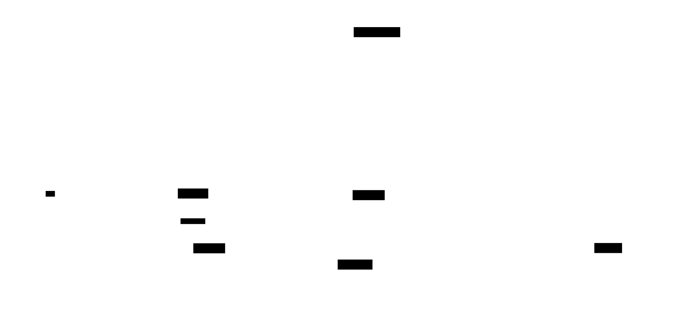

# Conductor: a persistent orchestrator for your agent-deck sessions



A **conductor** is one long-lived Claude Code session whose whole job is to supervise other sessions. You do not code in it. You do not read files with it. You talk to it (from your terminal, from Telegram, from Slack, from anywhere you have a bot) and it delegates the work to child sessions, watches what they do, and reports back.

If you have ever run `claude` directly, closed the terminal, and come back to find the session gone, you already understand half the problem a conductor solves. The other half is that even while your `claude` is alive, it is bound to your keyboard: you cannot ask it for status from your phone, you cannot hand off to a colleague, you cannot fan out three investigations in parallel and reconvene.

A conductor is the foreman on a jobsite. You send instructions to the foreman. The foreman assigns them to workers (child sessions in agent-deck). You do not need to stand next to each worker; you just need to know the foreman is reachable.

## What a conductor actually is

Under the hood, a conductor is:

- A `claude` process pinned inside a named tmux session managed by agent-deck.
- A directory at `~/.agent-deck/conductor/<name>/` (XDG installs: `~/.local/share/agent-deck/conductor/<name>/`) that holds its instructions, policy, learnings, state, and task log.
- An agent-deck session record (`agent-deck list` will show it) with `is_conductor: true`.
- Optionally, one or more channels attached (Telegram today, more planned) so you can talk to it remotely.
- Optionally, a heartbeat daemon that pings the conductor on a schedule, keeping it honest about idle-while-work-is-pending states.

Everything else (which models it uses, which policy it follows, how it splits work) is configured through the files in its directory. Those files are the contract.

> **Path note.** Examples in this guide use the legacy `~/.agent-deck/` layout. On new installs (v1.9.48+) durable conductor state lives under `$XDG_DATA_HOME/agent-deck/` (default `~/.local/share/agent-deck/`) and `config.toml` under `$XDG_CONFIG_HOME/agent-deck/` (default `~/.config/agent-deck/`). Existing `~/.agent-deck` installs keep working via legacy fallback, and `agent-deck migrate-paths` copies a legacy layout into the XDG one.

## Why you would want one

- **It survives your terminal.** Close iTerm, reboot, come back a day later. The tmux session is still there, the Claude process is still there, the conductor knows where it left off.
- **It is reachable from anywhere.** Pair a Telegram bot once. From then on, any message to that bot reaches the conductor, and the conductor's replies come back to your chat.
- **It delegates.** Instead of one Claude doing everything serially, the conductor spawns child sessions per project or per investigation, points them at the right worktree, and monitors their output.
- **It keeps an audit trail.** Every action the conductor takes gets appended to `task-log.md`. Every pattern it learns, successes and failures both, goes into `LEARNINGS.md`. You can read both with any editor.
- **It self-polices.** The `POLICY.md` file tells it what to auto-respond to and what to escalate to you. Routine requests get handled. Anything ambiguous or destructive gets thrown back at you via the channel.

## Quickstart (about ten minutes)

Requirements: agent-deck installed, a project path in mind, and (optional) a Telegram bot token.

### 1. Create the conductor

```bash
agent-deck conductor setup my-conductor --description "Supervises work in ~/projects/foo"
```

This creates:

```
~/.agent-deck/conductor/my-conductor/
├── CLAUDE.md          # per-conductor startup checklist (auto-generated)
├── POLICY.md          # symlink to shared policy, or a per-conductor copy
├── LEARNINGS.md       # patterns that worked or failed (starts empty)
├── state.json         # persistent state across compactions (conductor writes this)
└── task-log.md        # append-only log of what the conductor did (conductor writes this)
```

It also registers a session in agent-deck's registry and prints the session ID.

### 2. Start it

```bash
agent-deck session start my-conductor
```

The tmux session spins up, Claude boots inside it, reads `CLAUDE.md` on start, and is now alive and waiting for its first instruction.

To send something to it from your shell:

```bash
agent-deck session send my-conductor "status?"
agent-deck session output my-conductor
```

### 3. Attach a Telegram channel (optional but recommended)


Attaching a channel is what makes the conductor reachable remotely.

**3a. Create a bot.** Open Telegram, message `@BotFather`, run `/newbot`, answer the two prompts, save the token it gives you. Token format is `{digits}:{alphanumeric}`.

**3b. Find your chat ID.** Send any message to your new bot, then open `https://api.telegram.org/bot{YOUR_BOT_TOKEN}/getUpdates` in a browser. The `chat.id` in the response is `{YOUR_CHAT_ID}`.

**3c. Make sure the telegram plugin is installed but not globally enabled.** You want the plugin's code on disk so agent-deck can activate it per-session. You do **not** want `enabledPlugins."telegram@claude-plugins-official" = true` in any profile's `settings.json`: that flag leaks a poller to every Claude session under the profile, and agent-deck will warn about it (`GLOBAL_ANTIPATTERN`, `DOUBLE_LOAD`). Check the flag with `jq '.enabledPlugins' "$CLAUDE_CONFIG_DIR/settings.json"` and remove the entry if it is there. The plugin gets activated per-session via the `channels` field in step 3f; step 3e injects the state dir.

**3d. Pick a state directory for this bot.** One directory per bot. Never share across conductors.

```bash
mkdir -p ~/.agent-deck/channels/telegram-my-conductor
echo "{YOUR_BOT_TOKEN}" > ~/.agent-deck/channels/telegram-my-conductor/.env
chmod 600 ~/.agent-deck/channels/telegram-my-conductor/.env
```

**3e. Wire the env in `~/.agent-deck/config.toml`.** The conductor needs `TELEGRAM_STATE_DIR` set at launch. The clean way is an `env_file`:

```toml
[conductors.my-conductor.claude]
config_dir = "~/.claude"
env_file   = "~/.agent-deck/conductor/my-conductor/.envrc"

# If you use groups:
[groups.my-conductor.claude]
config_dir = "~/.claude"
env_file   = "~/.agent-deck/conductor/my-conductor/.envrc"
```

Then write the envrc, pointing `TELEGRAM_STATE_DIR` at this conductor's
channel directory (the one you created in step 3d):

```bash
STATE_DIR="$HOME/.agent-deck/channels/telegram-my-conductor"
echo "export TELEGRAM_STATE_DIR=$STATE_DIR" \
  > ~/.agent-deck/conductor/my-conductor/.envrc
```

**3f. Attach the channel to the conductor session.**

```bash
agent-deck session set my-conductor channels plugin:telegram@claude-plugins-official
```

**3g. Restart the session so the channel comes up.**

```bash
agent-deck session restart my-conductor
```

**3h. Verify.**

```bash
# A single bun telegram process should be running, owning your state dir:
pgrep -af 'bun.*telegram' | grep telegram-my-conductor

# The bot responds to /getMe:
curl -s "https://api.telegram.org/bot{YOUR_BOT_TOKEN}/getMe" | jq .ok
# -> true
```

Send a message to the bot in Telegram. The conductor should receive it within a few seconds.

## State files: what each is for

Everything lives under `~/.agent-deck/conductor/<name>/` (XDG installs: `~/.local/share/agent-deck/conductor/<name>/`).

### `CLAUDE.md`

The startup checklist Claude reads on every session start or resume. Generated by `conductor setup` from a template, customizable with `--instructions-md`. Tells the conductor what its scope is, what agents live in its group, and what the reading order of the other files is.

### `POLICY.md`

The auto-response contract. Reads something like: "Messages that match pattern X → auto-respond with Y. Messages that ask for Z → escalate to the user with `NEED: ...`." The shared default is installed into the conductor base dir; `--policy-md` on `conductor setup` overrides it per conductor. You own this file; edit it directly when you want the conductor to behave differently.

### `LEARNINGS.md`

Append-only notes on what worked and what did not. The conductor is instructed to consult this at session start and write a new entry whenever a pattern stabilizes: either "this approach works reliably, keep doing it" or "this approach failed for reason X, avoid it". Over time this becomes your conductor's institutional memory.

### `state.json`

The conductor's own working memory across Claude compactions. Small JSON file. Per the template instructions, it holds summaries of each child session's state, the current top-level goal, and any handoff notes. The conductor reads it at the start of every interaction and updates it after every action. You almost never need to read or edit it yourself; when you do, `jq` over it is fine.

### `task-log.md`

Append-only timeline of what the conductor did and why. Useful for audits, for catching drift, and for writing post-incident reports. Format is freeform markdown; each entry is timestamped.

## Heartbeat protocol

If you enabled heartbeat at setup (it is enabled by default), agent-deck installs a `systemd --user` timer (Linux) or launchd agent (macOS) that pings the conductor on a schedule. Each ping is a simple message like:

```
[HEARTBEAT]
```

The first action on every heartbeat is to drain its inbox:

```bash
agent-deck inbox drain self
```

This pulls any child completions that landed in the conductor's durable outbox
(`~/.agent-deck/inboxes/<id>.jsonl`) while it was busy. Delivery is pull, not push
(issue [#1225](https://github.com/asheshgoplani/agent-deck/issues/1225) /
[#1226](https://github.com/asheshgoplani/agent-deck/issues/1226)): a child that
finishes mid-turn commits its completion to disk rather than typing into the
conductor's pane. The conductor's synchronous Stop hook drains the same queue at
each turn boundary (the busy-conductor path); this heartbeat drain is the
idle-conductor fallback. Together they guarantee no completion is missed.

The conductor then responds with either:

```
[STATUS] {one-line summary of current state}
```

when everything is on track, or:

```
NEED: {question or decision point}
```

when it is blocked and wants to escalate. If a Telegram channel is attached, `NEED:` lines are forwarded to your chat; `[STATUS]` lines log to the task log and are only surfaced if you ask.

Why bother? The heartbeat prevents a failure mode where a conductor appears healthy (tmux alive, Claude alive) but has silently drifted: it thinks it is waiting on you, you think it is waiting on a worker, nothing moves for hours. The heartbeat forces a periodic self-report.

To disable heartbeat for a conductor:

```bash
agent-deck conductor setup my-conductor --no-heartbeat
```

## Running multiple conductors

A typical setup: one conductor per logical scope. Work conductor, personal conductor, each customer, each repo, whatever axis you cut on.

Rules for multi-conductor hosts:

1. **One bot per conductor, never shared.** Share-a-bot leaks messages between scopes. Always pair a dedicated bot to each conductor.
2. **One state directory per bot.** Every `TELEGRAM_STATE_DIR` is distinct. Two conductors pointing at the same state dir race each other for every inbound message.
3. **Check for poller collisions.** After starting all conductors, `pgrep -af 'bun.*telegram' | wc -l` should equal the number of conductors with a telegram channel attached. If it is lower, one is not running; if it is higher, something is double-spawning.

### A shortcut: worker-child isolation (v1.7.40+)

In older agent-deck versions, a conductor that spawned a child session via `agent-deck launch` could accidentally inherit the parent's `TELEGRAM_STATE_DIR`, spawning a phantom poller inside the child. v1.7.40 fixed this structurally by giving every `launch` child an ephemeral scratch `CLAUDE_CONFIG_DIR` so the plugin does not get re-activated.

Practical upshot: you can let your conductor spawn children liberally; the pollers stay pinned to the conductor itself.

## Common gotchas

**Plugin globally enabled by accident.** The opposite of the old trap: setting `enabledPlugins."telegram@claude-plugins-official" = true` in a profile's `settings.json` does *not* help, and actively leaks a poller to every Claude session under that profile. agent-deck warns about it (`GLOBAL_ANTIPATTERN`, `DOUBLE_LOAD`). The plugin code needs to be installed (`claude plugin add telegram@claude-plugins-official`) but disabled at the profile level; per-session activation happens through the session's `channels` field.

**Tokens in git.** Never. Not in your conductor CLAUDE.md, not in a script you commit, not in the envrc if that envrc is under version control. The tokens live in the channel state directory only, chmod 600. If a token lands in git, revoke it via BotFather immediately; the bot token cannot be rotated in-place.

**Wrapper-based env injection.** Older guides suggested `session set <id> wrapper "env FOO=bar {command}"`. This does not persist across `agent-deck session restart` or `claude --resume` and will occasionally flip your conductor to `error`. Use `[conductors.<name>.claude].env_file` in `config.toml` instead.

**Blanket kills during debug.** Do not `pkill -f 'bun.*telegram'` or `tmux kill-server` on a host with a live conductor. The first destroys all pollers across every conductor at once; the second destroys every agent-deck tmux session simultaneously. If you need to restart one poller, prefer `agent-deck session restart <conductor>`.

**Profile mismatch on setup.** If you run `conductor setup` under the wrong profile (`CLAUDE_CONFIG_DIR` pointing somewhere unintended), the conductor's config_dir resolution may later fail, and the session flips to `error` on resume. `agent-deck conductor teardown <name> --remove` is the clean-slate reset; you can run it and set up fresh without losing anything outside the conductor dir.

**Children silently orphaned.** When a conductor launches a child session, the parent linkage is what carries status events back. The CLI auto-fills `parent_session_id` from `$AGENTDECK_INSTANCE_ID` when that env var is in scope, but worktree-setup hooks, sandboxed shells, and watchdog-spawned shells routinely drop it. Pass `-parent "$AGENTDECK_INSTANCE_ID"` explicitly on every `agent-deck launch` / `add` to make it belt-plus-suspenders. Existing orphans can be relinked retroactively with `agent-deck session set-parent <child> "$AGENTDECK_INSTANCE_ID"`. Watchers that run *outside* the conductor process must NOT call `launch` or `add` directly — see [WATCHERS.md](WATCHERS.md) for the doorbell pattern.

**Children land in the wrong group.** When a conductor launches a child, the child inherits the conductor's group at creation time — for a conductor in the `conductor` group, that means children pile into the conductor row in the TUI tree. The `conductor` group is reserved for the conductor sessions themselves; children belong in a project group named after the conductor (e.g. an `ops` conductor's children go in the `ops` group, an `infra` conductor's children in `infra`). Either pass `-g <my-project-group>` on the launch command, or run `agent-deck group move <child> <my-project-group>` immediately after creation.

**Resume-from-summary picker stalls long-running conductors.** Once a conductor's claude session crosses ~250k tokens, `claude --resume` shows an interactive picker ("Resume from summary / Resume full / Don't ask again"). The conductor has no human at the terminal to answer, so it would sit on the picker indefinitely and look stuck on `waiting`. **Auto-handled as of v1.7.73 (#67):** agent-deck samples the pane after restart and auto-confirms the default option (Resume from summary) within a few seconds. To opt out, set `[claude].auto_resume_summary = false` in `~/.agent-deck/config.toml` and fall back to the manual workaround: `agent-deck session send <conductor> ""` to inject Enter.

## Lifecycle commands

```bash
# Create
agent-deck conductor setup <name> [--description "..."] [--agent claude|codex] \
    [--heartbeat|--no-heartbeat] [--instructions-md path] [--policy-md path]

# Observe
agent-deck conductor list
agent-deck conductor status            # all conductors
agent-deck conductor status <name>     # one conductor

# Operate
agent-deck session start <name>
agent-deck session stop <name>
agent-deck session restart <name>
agent-deck session send <name> "message"
agent-deck session output <name>

# Tear down
agent-deck conductor teardown <name>              # stop, keep files
agent-deck conductor teardown <name> --remove     # stop and delete dir
agent-deck conductor teardown --all --remove      # nuke every conductor on this host
```

The `--remove` flag is destructive: it deletes `~/.agent-deck/conductor/<name>/`. Your `LEARNINGS.md` and `task-log.md` go with it. Snapshot them first if they matter.

## Where to go next

- [SKILLS.md](SKILLS.md): conductors lean on skills heavily; how the two-tier skill system works.
- [WATCHDOG.md](WATCHDOG.md): optional ops script that keeps a flaky conductor alive by auto-restarting it and catching stuck children.
- [SESSION-PERSISTENCE-SPEC.md](../docs/SESSION-PERSISTENCE-SPEC.md): the underlying session-persistence rules conductors inherit.
